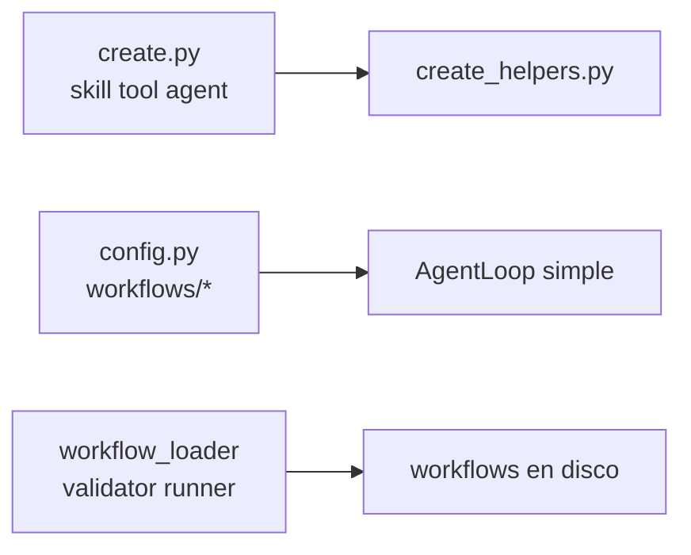

  

---

<h1 align="center">Creador de Workflows — Estado y Objetivo</h1>

---

<h3 align="center">Sacar la creación de workflows del tab Info del agente hacia una página dedicada</h3>

---

## Descripción

Los workflows se crean hoy desde el tab Info del agente (`WorkflowsPanel + WorkflowCreator` en `frontend/src/components/agentInfoTab.tsx`). El objetivo es un **creador dedicado** (`frontend/workflow.html` + `src/workflow/WorkflowInterface.tsx`) con el mismo CSS (`src/createColors.css`) y el mismo flujo de entrevista/generación que tools, skills y agentes.

## Estado actual (verificado)

### Backend

| Pieza | Ubicación | Rol |
|---|---|---|
| Endpoints creadores | `backend/routes/create.py` (`/api/create/skill\|tool\|agent` SSE) | Entrevista + generación con `create_helpers.py`. Sin endpoint de workflow. |
| Endpoints workflows | `backend/routes/config.py` (`/api/config/workflows/selection\|select\|validate\|save\|generate`) | `generate` usa `AgentLoop` simple, sin streaming ni entrevista. |
| Helpers creación | `backend/agent/utils/create_helpers.py` | `stream_interview_loop`, `stream_tool_calling_loop`, `resolve_create_model_provider`. |
| Helpers workflows | `backend/agent/utils/workflow_loader.py`, `workflow_validator.py`, `workflow_runner.py` | Carga con `realpath`, validación de schema, ejecución. Sin `workflows_helpers.py`. |
| Prompts | `backend/agent/prompts/interview_*\|create_*\|iterate_*.md` | Solo skill/tool/agent. Sin prompts de workflow. |
| Montaje | `backend/main.py` (`create_router` en `/api`, `config_router` en `/api`) | Sin router nuevo necesario. |

### Frontend

| Pieza | Ubicación | Rol |
|---|---|---|
| Páginas creadoras | `skill.html/tool.html/agent.html` + `src/skill\|tool\|agent/*Interface.tsx` | Setup + chat SSE + `CreateModelSelector`. Sin `workflow.html`. |
| Entradas vite | `frontend/vite.config.ts` | Solo `main/skill/rag/tool/agent`. Falta `workflow`. |
| Acceso | `frontend/src/components/createTab.tsx` | Botones a `tool/skill/agent/rag.html`. Falta workflow. |
| Panel actual | `agentInfoTab.tsx` (`WorkflowsPanel + WorkflowCreator`) | Selector smart/workflow + editor inline de nodos + YAML. |
| Servicios | `frontend/src/services/configService.ts` | `getWorkflowSelection/selectWorkflow/validateWorkflow/saveWorkflow/generateWorkflow`. |
| CSS | `frontend/src/createColors.css` | Paleta única indigo/violet para skill/rag/tool. |

## Objetivo del creador

* Nueva página `workflow.html` con `WorkflowInterface.tsx`: setup (nombre/descripción + `CreateModelSelector` efímero) + chat SSE contra `POST /api/create/workflow` + editor YAML con validar/guardar (reutilizando `configService`).
* Nuevo endpoint `POST /api/create/workflow` en `create.py` con contrato SSE `workflow_action/workflow_result`, fases entrevista → evaluar si existe → crear → validar con `workflow_validator`.
* Nuevos prompts `interview_workflow/create_workflow/iterate_workflow.md` y helper `workflows_helpers.py` (listar/evaluar, espejando tools/skills).
* Nuevo botón en `createTab.tsx` y entrada en `vite.config.ts`. Mismo `createColors.css`.
* No se borra el panel viejo en esta fase; solo se documenta como pendiente de deprecación.

## Qué existe / qué falta

* Existe: validación, guardado, selección, ejecución, panel inline.
* Falta: página dedicada, endpoint de creación con entrevista, prompts, helpers de evaluación, enlace desde crear.

---

Copyright (c) 2026 synapse-ai-hub

---
